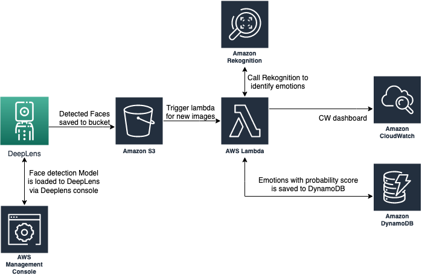

# Live Emotion Rekognition using DeepLens

We are using Deeplens and Amazon Rekognition service to detect emotions on a person's face. We can track them overtime to analyze the overall user emotion while watching a movie or during a conversation.

## Amazon Rekognition - Facial Analysis
https://console.aws.amazon.com/rekognition/home?region=us-east-1#/face-detection
 
If we expand the <b>Response</b> of right hand side, you will see the various emotions detected from the face

## Architecture

## Pre-requisite
1. DeepLens device (https://www.amazon.com/AWS-DeepLens-learning-enabled-developers/dp/B075Y3CK37)
2. AWS Account with access to AWS services

## Steps high level
### Step 1: Register Your AWS DeepLens Device and Deploy an AWS DeepLens Sample Project to get started with deep lens
### Step 2: Create a s3 bucket to store face images
### Step 3: Create a lambda function that will run on the DeepLens device and rekognize emotions
### Step 4: Create a lambda function that will push images data to from S3 bucket to DynamoDb and cloudwatch

# Step 1: Register Your AWS DeepLens Device

If you are absolute beginner I would recommend to follow getting started guide else skip to step 2.
https://docs.aws.amazon.com/deeplens/latest/dg/deeplens-getting-started-register.html

once registration is done, we will build and run the Head Pose Detection Project with TensorFlow-Trained Model
https://docs.aws.amazon.com/deeplens/latest/dg/deeplens-project-headpose-with-tensorflow-model.html

# Step 2: Create a s3 bucket to store face images
https://console.aws.amazon.com/s3/home?region=us-east-1
Create a bucket name with prefix deeplens-faces-<yourname>

