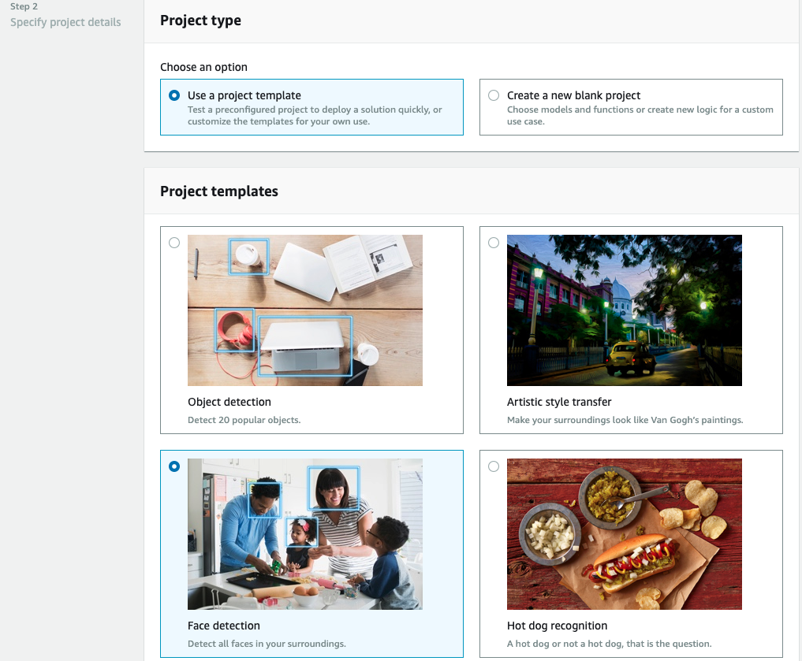

# Live Emotion Rekognition using DeepLens

We are using Deeplens and Amazon Rekognition service to detect emotions on a person's face. We can track them overtime to analyze the overall user emotion while watching a movie or during a conversation.

## Amazon Rekognition - Facial Analysis
https://console.aws.amazon.com/rekognition/home?region=us-east-1#/face-detection
 
If we expand the <b>Response</b> of right hand side, you will see the various emotions detected from the face

## Architecture

## Pre-requisite
1. DeepLens device (https://www.amazon.com/AWS-DeepLens-learning-enabled-developers/dp/B075Y3CK37)
2. AWS Account with access to AWS services

# Steps high level
- Step 1: Register Your AWS DeepLens Device and Deploy an AWS DeepLens Sample Project to get started with deep lens
- Step 2: Create a s3 bucket to store face images
- Step 3: Create a lambda function that will run on the DeepLens device and rekognize emotions
- Step 4: Create and deploy model on DeepLens device
- Step 5: Create a lambda function that will push images data to from S3 bucket to DynamoDb and cloudwatch

# Step 1: Register Your AWS DeepLens Device

If you are absolute beginner I would recommend to follow getting started guide else skip to step 2.
https://docs.aws.amazon.com/deeplens/latest/dg/deeplens-getting-started-register.html

once registration is done, we will build and run the Head Pose Detection Project with TensorFlow-Trained Model
https://docs.aws.amazon.com/deeplens/latest/dg/deeplens-project-headpose-with-tensorflow-model.html

# Step 2: Create a s3 bucket to store face images
https://console.aws.amazon.com/s3/home?region=us-east-1

Create a bucket name with prefix deeplens-faces-yourname

# Step 3: Create a lambda function that will run on the DeepLens device and rekognize emotions
https://console.aws.amazon.com/lambda/home?region=us-east-1#/functions

Create function

Name the function: DeepLens-sentiment-your-name
Runtime: pyhton 2.7
Role: Choose an existing role
Existing Role: AWSDeepLensLambdaRole
Click Create Function.

Download this <a href="https://github.com/sameer-goel/live-emotion-rekognition/blob/master/deeplens-sentiment-function/deeplens-lambda.zip?raw=true">sample code template</a>
Under Function Code > Code entry type drop down > Upload a .zip file
Now click the SAVE button on the right top of the page

replace the lambda_function.py with code <a href="https://raw.githubusercontent.com/sameer-goel/live-emotion-rekognition/master/deeplens-sentiment-function/lambda_function.py">code</a> and don forget to mention your bucket name at line 89
line 89| bucket_name = "deepelens-faces-sameerg"
SAVE the code again, and Publish a new version so that it can appear in DeepLens console.

# Step 4: Create and deploy model on DeepLens device

We will create sample project from template just so that we have face detection model in our list, we will be re-using this pre-trained model along with the function we created in step 3

Create Sample project from template
https://us-east-1.console.aws.amazon.com/deeplens/home?region=us-east-1#projects/create

Next we create our custom model

Add existing model and add the function we published

We will deploy this project to our device, it can several minutes.

* Note: If your model download progress hangs at a blank state (Not 0%, but blank) then you may need to reset greengrass on DeepLens. To do this, log onto the DeepLens device, open up a terminal, and type the following command: 
sudo systemctl restart greengrassd.service --no-block
After a couple minutes, you model should start to download.

You can go to IOT to see published messages

* Pushing to S3 failed: An error occurred (AccessDenied) when calling the PutObject operation: Access Denied
You have provide s3 permissions (AmazonS3FullAccess) to role AWSDeepLensGreengrassGroupRole
https://console.aws.amazon.com/iam/home?region=us-east-1#/roles/AWSDeepLensGreengrassGroupRole

Till now we see on the IOT console that it is recognizing the faces. In next steps we will call rekognition to get the emotion.

- Step 5: Create a lambda function that will push images data to from S3 bucket to DynamoDb and cloudwatch

Create a dynamodb table https://console.aws.amazon.com/dynamodb/home
Click on Create Table.
Table name: rekognize-faces
Primary key (string): s3key
reave rest settings at default
Click on Create. This will create a table in your DynamoDB.

